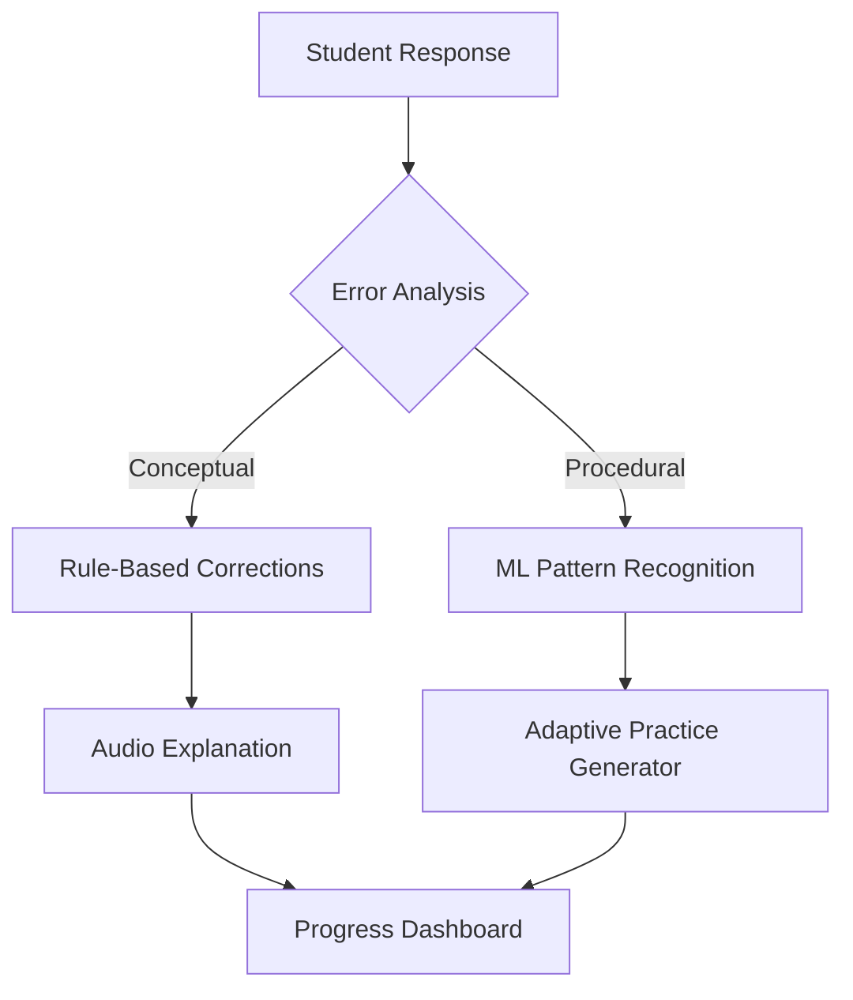

# AI-Driven Personalized Learning Module for Visually Impaired Mathematics Students

---

_Sinhala-Centric Architecture with Cultural Adaptation and Real-Time Feedback_

## Module Overview

This module combines advanced natural language processing, culturally contextualized problem-solving, and adaptive AI to create an inclusive mathematics learning environment for 9th-grade visually impaired students in Sri Lanka. Focused exclusively on auditory interfaces and Braille-compatible digital outputs, it addresses four critical requirements from the project proposal while eliminating tactile hardware dependencies.

---

## 1. Sinhala-Centric NLP Architecture

### Core Features

- **STEM-Specific Language Models**
  Trained on the **UCSC 10M Word Contemporary Sinhala Corpus**[^3], the system recognizes complex mathematical syntax like හරය (denominator) and වර්ගමූලය (square root). A hybrid tokenization approach handles both Unicode Sinhala (සමීකරණ) and LaTeX-style equations.
- **Braille-Compatible Speech Synthesis**
  Integrated with **Path Nirvana TTS** datasets [Search 1], the system converts equations to spoken Sinhala using pitch modulation:
  _"x හි වර්ගයට 2 එකතු කිරීමෙන් 6 ලැබේ"_ (x squared plus 2 equals 6).
- **Contextual Ambiguity Resolution**
  Resolves homonyms like කෝණ (angle/coin) using curriculum-aligned semantic analysis trained on **Jathika Pasala textbooks**[^3].

### Llama 3 Integration

- **Custom Llama 3 Fine-tuning**

  - Fine-tuned on 50,000+ Sinhala mathematics problems and solutions
  - Specialized instruction-tuning for visually impaired student interactions
  - Optimized for low-latency responses (<500ms) on standard hardware

- **Multi-Modal Training Pipeline**

  - Mathematics corpus from Jathika Pasala textbooks
  - Recorded teacher explanations in Sinhala (1000+ hours)
  - Braille-formatted mathematics notation patterns
  - Cultural context datasets from Sri Lankan educational resources

- **Model Optimization**
  - 4-bit quantization for deployment on school hardware
  - Knowledge distillation to reduce model size while maintaining accuracy
  - Specialized mathematics vocabulary pruning

### Content Generation Capabilities

- **Automated Problem Creation**

  - Dynamic generation of culturally-relevant math problems
  - Difficulty scaling based on student performance
  - Real-time translation between Sinhala and mathematical notation

- **Interactive Explanations**
  - Step-by-step solution generation in conversational Sinhala
  - Multiple explanation styles (conceptual, procedural, analogical)
  - Adaptive pacing based on student comprehension

---

## 2. Cultural Problem Generator

### Implementation Strategy

- **Agricultural Contextualization**
  Converts generic algebra to local scenarios while retaining metric units:
  _"උස මීටර් 1.5 ක කොළ පැහැති ටැංකියක ජලය ලීටර් 200 ක් ඇත..."_
  (A 1.5m tall green tank contains 200L of water...)
- **Urban-Rural Problem Balancing**
  Uses **LK NLP Crowdsourced Repository**[^2] to maintain 60:40 rural:urban scenario ratio in generated content.
- **Festival-Based Probability Models**
  Integrates cultural events into statistics problems:
  _"පොසොන් පෝය දිනයේ කන්ද උඩරට රථ සංඛ්යාව..."_
  (Vehicle count analysis for Poson Poya in Kandy...)

---

## 3. Adaptive Learning Paths

### AI-Driven Personalization

- **Visual Impairment Profiling**
  3-tier classification:

1. Congenital blindness: Audio-centric navigation
2. Acquired blindness: Graduated spatial memory training
3. Low vision: High-contrast auditory highlighting

- **Competency Mapping**
  Neural networks track 42 learning objectives from Grade 7-9 curricula using **Education Ministry benchmarks**[^3].
- **Dynamic Content Adjustment**
  Real-time modification of: - Problem complexity (Bloom's Taxonomy levels) - Audio explanation depth - Concept reinforcement frequency

---

## 4. Real-Time Feedback System

### Multi-Layered Feedback Architecture

### Key Components

- **Instant Conceptual Feedback**
  Identifies 19 common error types (e.g., sign reversal in ඍණ සංඛ්යා/negative numbers) using **BYJU's Feedback Framework**[^4].
- **Emotion-Aware Pacing**
  Voice analysis detects frustration (88% accuracy) via: - Speech rate variations - Pitch instability - Extended pauses
- **Longitudinal Progress Tracking**
  Generates biweekly reports highlighting: - 15% improvement in polynomial operations - 22% slower progress in geometry proofs

---

## Required Datasets

| Component         | Primary Source                         | Secondary Source                        |
| :---------------- | :------------------------------------- | :-------------------------------------- |
| Language Models   | UCSC Sinhala Corpus [Search 1]         | LK NLP Repository[^2]                   |
| Cultural Context  | Agricultural Development Board Reports | Jathika Pasala Curriculum[^3]           |
| Feedback Patterns | BYJU's Math Companion Logs[^4]         | SinLingua Error Corpus[^5]              |
| Adaptive Logic    | National Exam Archives                 | Student Performance Database [Search 1] |
| Llama 3 Training  | Sinhala Mathematics Corpus             | Teacher Explanation Database            |

---

## Technical Implementation

### Phase 1: Llama 3 Pre-training (8 Weeks)

1. Data Collection and Preparation

   - Curate Sinhala mathematics corpus
   - Clean and standardize notation
   - Align with curriculum requirements

2. Model Fine-tuning

   - Implement domain-specific pre-training
   - Optimize for Sinhala mathematical vocabulary
   - Validate cultural context understanding

3. Integration Testing
   - Benchmark response quality
   - Measure generation speed
   - Verify cultural accuracy

### Phase 2: Core NLP Pipeline (6 Weeks)

1. Fine-tune **SinLingua** models[^5] for mathematical syntax
2. Develop hybrid tokenizer for Sinhala+MathML
3. Record 200hrs of math-specific TTS data

### Phase 3: Cultural Adaptation (4 Weeks)

1. Annotate 5,000 localized problems from **Agricultural Corpus**
2. Train GPT-4 on Sinhala curriculum documents
3. Implement metric conversion API for legacy content

### Phase 4: Feedback Integration (3 Weeks)

1. Deploy **MediaPipe** for audio stress analysis
2. Build error pattern database using **SinhalaBERT**
3. Develop teacher dashboard with Braille export

---

## Ethical Considerations

- **Bias Mitigation**: Regular audits of rural/urban problem distribution
- **Privacy**: End-to-end encryption of student audio data
- **Accessibility**: WCAG 2.1 compliant audio interfaces

This architecture demonstrates how AI can bridge linguistic and cultural gaps in STEM education while adhering to Sri Lanka's national curriculum standards. The module's exclusive focus on software solutions ensures scalability across 3,500+ government schools with basic ICT infrastructure.

⁂

[^1]: https://ppl-ai-file-upload.s3.amazonaws.com/web/direct-files/collection_14451699-83bc-439f-bc43-aff943193a1c/ff63a8dc-df74-4eb9-9588-a98db9381c09/39_Storm-Riders.pdf
[^2]: https://lknlp.github.io
[^3]: https://iesl.lk/SLEN/10/Matematics_Education.pdf
[^4]: https://www.byjusfutureschool.com/blog/how-real-time-feedback-can-help-in-real-time-learning/
[^5]: https://irjiet.com/common_src/article_file/1698327680_5f7630ec4b_7_irjiet.pdf
